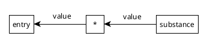
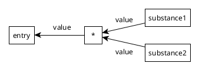
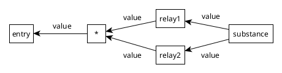
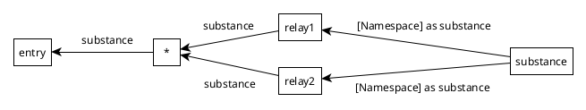

## Disambiguate Namespaces

Namespace exports through wildcards are not disambiguated in Node.js. 

The folders in this repo demonstrate a few situations. `entry.mjs` is a CLI entrypoint. `index.html` is a browser entrypoint.

- `collide` shows a collision, intended to raise an error. This throws everywhere.
- `resolve-value` shows disambiguation of a value within a module. This succeeds everywhere.
- `resolve-namespace` shows disambiguation of a module namespace. This succeeds in Firefox but throws in Node.js.

### Explanation

ECMAScript star exports relay all exported names.



```js
// substance.mjs
export const value = 'Curiouser and curiouser.'
```

```js
// relay.mjs
export * from './substance.mjs'
```

```js
// entry.mjs
import { value } from './relay.mjs'
console.log(value)
// Curiouser and curiouser.
```

If multiple star exports offer the same name, the name is ambiguous. Accessing it raises an error.



```js
// substance1.mjs
export const value = 'Curiouser and curiouser.'
```

```js
// substance2.mjs
export const value = "We're all mad here."
```

```js
// aggregate.mjs
export * from './substance1.mjs'
export * from './substance2.mjs'
```

```js
// entry.mjs
import { value } from './aggregate.mjs'
console.log(value)
// SyntaxError: The requested module './aggregate.mjs'
// contains conflicting star exports for name 'value'
```

Where different star exports take different paths to the same ultimate value, the name is unambiguous. Import logic disambiguates and provides the value.



```js
// substance.mjs
export const value = 'Curiouser and curiouser.'
```

```js
// relay1.mjs
export { value } from './substance.mjs'
```

```js
// relay2.mjs
export { value } from './substance.mjs'
```

```js
// aggregate.mjs
export * from './relay1.mjs'
export * from './relay2.mjs'
```

```js
// entry.mjs
import { value } from './aggregate.mjs'
console.log(value)
// Curiouser and curiouser.
```

Namespace exports are meant to disambiguate in the same way. Firefox does this but Node.js raises an error.



```js
// substance.mjs
export const value = 'Curiouser and curiouser.'
```

```js
// relay1.mjs
export * as substance from './substance.mjs'
```

```js
// relay2.mjs
export * as substance from './substance.mjs'
```

```js
// aggregate.mjs
export * from './relay1.mjs'
export * from './relay2.mjs'
```

```js
// entry.mjs
import { substance } from './aggregate.mjs'
console.log(substance)

// Firefox:
// Module { value: 'Curiouser and curiouser.' }

// Node.js:
// SyntaxError: The requested module './aggregate.mjs'
// contains conflicting star exports for name 'value'
```
